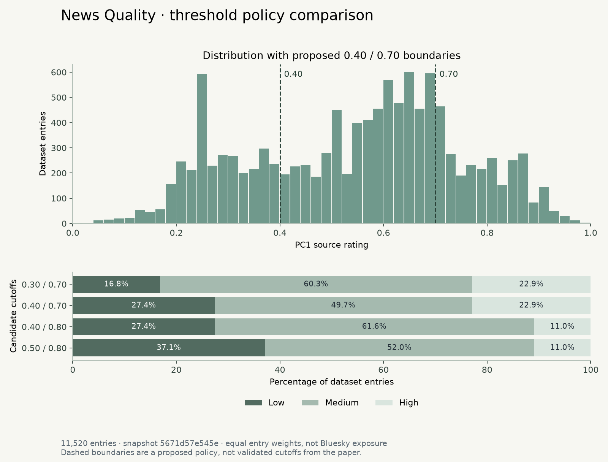

# Proposed source-quality thresholds

Status: proposal for local-preview evaluation; not adopted by the application and not a validated public-label policy.

## Recommendation

Start with **Low quality news source: score < 0.40; Medium quality news source: 0.40 ≤ score < 0.70; High quality news source: score ≥ 0.70**. Unmatched and unresolved links remain outside all categories. These cutoffs are our proposed convention, not thresholds supplied by the paper. They leave a broad middle category and use simple, reviewable boundaries. The alternative choices below remain plausible; these calculations do not establish an optimal threshold.

Under this proposal, 27.4% of entries are low, 49.7% medium, and 22.9% high. This counts dataset entries equally; it is not an estimate of how often Bluesky users would encounter each label.

## Evidence and reproducibility

Computed from [the pinned CSV](https://github.com/hauselin/domain-quality-ratings/blob/5671d57e545e48225ef2cbf559a6ab7f8f77a9de/data/domain_pc1.csv), revision `5671d57e545e48225ef2cbf559a6ab7f8f77a9de`: **11,520 entries**, including **46 section entries**. Median score: **0.582**. Counts use original scores, never rounded display values. Examples were selected to make consequences legible; they are not an independent validation set.

Run `node tools/analyze-thresholds.ts` after `npm ci` to regenerate this report and [the machine-readable calculations](threshold-analysis.json). Run `uv run --no-project --with matplotlib tools/plot-thresholds.py` to regenerate the chart.

## Candidate comparison

All policies use low < lower boundary, medium from the lower boundary up to but excluding the upper boundary, and high ≥ upper boundary.

| Candidate                | Low below | High from | Low           | Medium        | High          |
| ------------------------ | --------- | --------- | ------------- | ------------- | ------------- |
| Earlier illustration     | 0.30      | 0.70      | 1,937 (16.8%) | 6,943 (60.3%) | 2,640 (22.9%) |
| Proposed starting policy | 0.40      | 0.70      | 3,155 (27.4%) | 5,725 (49.7%) | 2,640 (22.9%) |
| Stricter high category   | 0.40      | 0.80      | 3,155 (27.4%) | 7,101 (61.6%) | 1,264 (11.0%) |
| Wider low category       | 0.50      | 0.80      | 4,271 (37.1%) | 5,985 (52.0%) | 1,264 (11.0%) |

The earlier 0.30 / 0.70 illustration gives Daily Mail and Daily Wire a medium category; 0.40 / 0.70 moves them to low. Raising the upper boundary to 0.80 moves The Guardian, Al Jazeera, and bbc.co.uk to medium. Widening low to below 0.50 also moves Daily Caller and Daily Kos to low. These are consequences to decide on, not reasons to tune scores around preferred brands.

## Recognizable examples under the proposal

Scores here are rounded to three decimals for reading. Category assignment uses the full stored value.

| Source entry       | PC1   | Proposed category |
| ------------------ | ----- | ----------------- |
| reuters.com        | 1.000 | high              |
| apnews.com         | 0.998 | high              |
| bbc.com            | 0.882 | high              |
| wired.com          | 0.852 | high              |
| washingtonpost.com | 0.819 | high              |
| aljazeera.com      | 0.779 | high              |
| theguardian.com    | 0.750 | high              |
| bbc.co.uk          | 0.718 | high              |
| cnn.com            | 0.658 | medium            |
| foxnews.com        | 0.534 | medium            |
| dailycaller.com    | 0.470 | medium            |
| dailykos.com       | 0.414 | medium            |
| dailymail.co.uk    | 0.384 | low               |
| dailywire.com      | 0.357 | low               |
| breitbart.com      | 0.297 | low               |
| infowars.com       | 0.046 | low               |

## Boundary sensitivity

The following counts show how many entries switch if only one boundary moves; the other remains fixed. They measure policy sensitivity, not classification error.

| Cutoff | Move down by 0.025 | Move up by 0.025   |
| ------ | ------------------ | ------------------ |
| 0.40   | 321 entries switch | 222 entries switch |
| 0.70   | 690 entries switch | 592 entries switch |

For example, clinicaltrialsarena.com has score 0.699984811952302 while jamanetwork.com has 0.700002508921952. Both display as 0.700 at three decimals but lie on opposite sides of the proposed high cutoff. A future categorical preview should expose sufficient precision or explain near-boundary results instead of implying a meaningful quality gap.

## What this analysis cannot establish

The [methodology review](threshold-methodology.md) explains why these values are historical ensemble scores rather than current article verdicts, confidence probabilities, or a paper-approved three-band classification. The [pinned commit](https://github.com/hauselin/domain-quality-ratings/commit/5671d57e545e48225ef2cbf559a6ab7f8f77a9de) dates to September 2023; fetching it today does not refresh its underlying judgments.

The exact entries bbc.com and bbc.co.uk differ (0.882 versus 0.718). Domain-specific input coverage and imputation matter; this analysis does not infer which score better represents the organization. No per-entry confidence or original-observation count is supplied by the two-column CSV.

The selected checks globo.com, g1.globo.com, folha.uol.com.br, uol.com.br, estadao.com.br, and eluniversal.com.mx have no exact entries in this snapshot. This small coverage check is not a regional audit. Missing sources must remain unmatched rather than medium or low.

The Onion scores 0.446 and Babylon Bee 0.386. The dataset alone does not supply a satire-specific product policy; categories must not be described as fact-checks of individual stories.

## Decision to make

Approve 0.40 / 0.70 for a **local categorical preview**, or choose an alternative after inspecting these consequences. Keep the score, matched entry, snapshot, and proposed-policy status visible. Independently validating the categories and deciding mixed-source publication behavior remain separate steps before public label publication.
